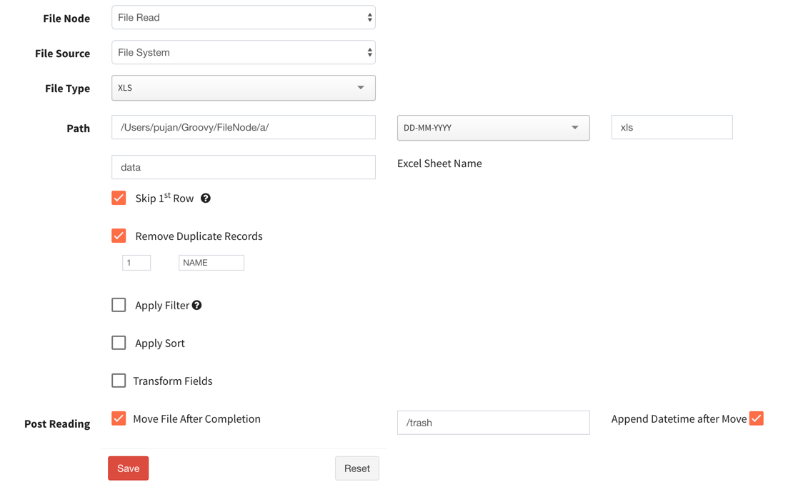

# Filenode

This project aims to provide file activity node to BPM projects. This repo only provides frontend UI.

## Features
* Read/Write Local Files
* Read/Write Remote Files
* FTP, Secure FTP, FTP over SSL are supported for remote files.
* CSV, txt, Fixed Width (FW), XLS, Delimited files are supported.
* Regular expression for files selection
* Operations are allowed after task such as move files to trash 
* Remove Duplicate Records
* Apply Filter when read data
* Apply sorting of data
* Field or Column transformation.

## Frontend UI

